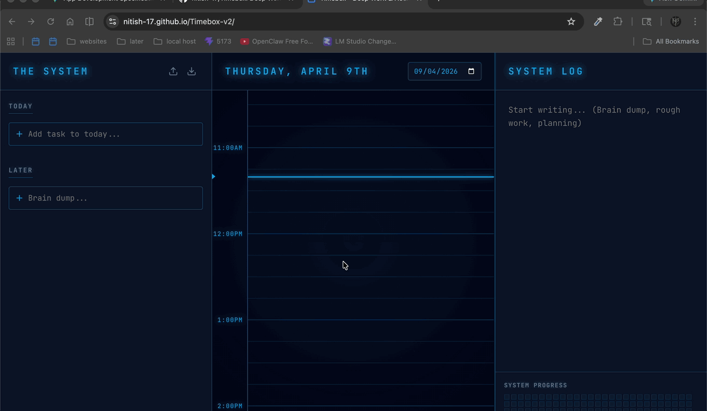
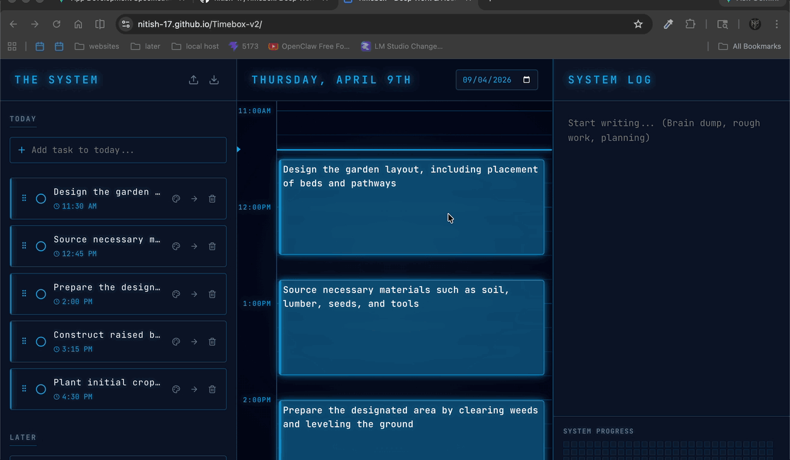

# ⏱️ Timebox

> **🚀 Deployed Website:** [https://nitish-17.github.io/Timebox-v2/](https://nitish-17.github.io/Timebox-v2/)

## 📖 About the Project

A minimalist personal time-boxing application inspired by [timebox.so](https://www.timebox.so/). Designed with a local-first philosophy, the app ensures all your data remains private and is stored securely within your browser.

## ✨ Features

- **Daily Planning:** Effortlessly add tasks and notes for every day.
- **Rapid Scheduling:** Quickly schedule tasks on the calendar for efficient time-boxing and time-blocking.
- **Data Portability:** Built-in Export and Import functionality to save your data to a file, providing a backup whenever you need to clear your browser data.
- **AI-Powered Planning:** Works with local LLMs (LM Studio) for automated idea -> tasks, task -> notes(steps).
- **Enhanced UI:** Features an updated Solo Leveling-inspired UI.

---

